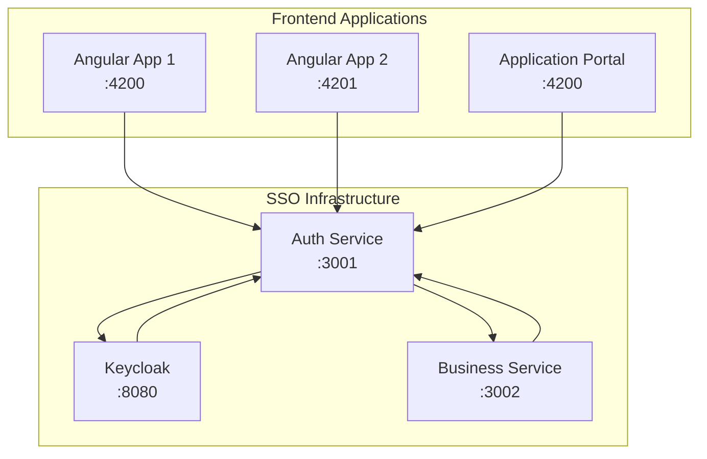

# 🔐 Enterprise SSO Proof of Concept

A complete Single Sign-On (SSO) implementation using **Keycloak**, **Angular**, and **Node.js** microservices. This proof-of-concept demonstrates enterprise-grade authentication, authorization, and session management across multiple applications.

## 🏗️ **Architecture Overview**

## ✨ **Key Features**

- **🔑 OAuth2/OIDC Authentication** with Keycloak
- **🔄 Automatic Token Refresh** for seamless user experience
- **🏢 Backend-for-Frontend (BFF)** pattern implementation
- **🔒 Session-Based Authentication** between microservices
- **👥 Role-Based Access Control** (RBAC)
- **🌐 Cross-Domain Session Sharing**
- **🔧 Development & Production Configurations**
- **📊 Health Monitoring** and diagnostics
- **🔐 HTTPS Support** with development certificates

## 🚀 **Quick Start**

### **Prerequisites**
- Node.js 18+ and npm
- Docker & Docker Compose
- Angular CLI

### **1. Clone & Install**
\`\`\`bash
git clone <your-repo-url>
cd sso-poc
npm install
\`\`\`

### **2. Start Keycloak**
\`\`\`bash
cd keycloak
docker-compose up -d
\`\`\`

### **3. Setup Environment**
\`\`\`bash
# Copy and configure environment files
cp apis/auth-service/.env.example apis/auth-service/.env
cp apis/business-service/.env.example apis/business-service/.env
\`\`\`

### **4. Start Services**
\`\`\`bash
# Terminal 1: Auth Service
cd apis/auth-service && npm start

# Terminal 2: Business Service  
cd apis/business-service && npm start

# Terminal 3: Angular App 1
cd apps/angular-app-1 && npm start

# Terminal 4: Angular App 2
cd apps/angular-app-2 && npm start
\`\`\`

### **5. Access Applications**
- **Keycloak Admin**: http://localhost:8080 (admin/admin)
- **Angular App 1**: http://localhost:4200
- **Angular App 2**: http://localhost:4201
- **Auth Service**: http://localhost:3001
- **Business Service**: http://localhost:3002

## 📁 **Project Structure**

\`\`\`
sso-poc/
├── 🔐 apis/                    # Backend Services
│   ├── auth-service/           # Central Authentication Service
│   │   ├── src/
│   │   │   ├── controllers/    # Auth, Session, Microservices
│   │   │   ├── middleware/     # Security, CORS, Sessions
│   │   │   ├── routes/         # API endpoints
│   │   │   └── services/       # Keycloak, Token management
│   │   └── server.js
│   └── business-service/       # Protected Business Logic
│       ├── src/
│       │   ├── controllers/    # Business endpoints
│       │   ├── middleware/     # Authentication
│       │   └── services/       # Auth service integration
│       └── server.js
├── 🎨 apps/                    # Frontend Applications
│   ├── angular-app-1/          # Demo Application 1
│   └── angular-app-2/          # Demo Application 2
├── 🐳 keycloak/                # Identity Provider
│   ├── docker-compose.yml      # Keycloak container
│   └── realm-export.json       # Pre-configured realm
├── 🔧 scripts/                 # Utility Scripts
│   ├── test-microservice.js    # Integration testing
│   └── setup-test-env.js       # Environment setup
├── 🔒 certs/                   # HTTPS Certificates
└── 📋 .vscode/                 # VS Code tasks & debug
\`\`\`

## 🔄 **Authentication Flow**

1. **User Login** → Angular app redirects to Keycloak
2. **Keycloak Authentication** → User enters credentials
3. **Authorization Code** → Keycloak redirects back with code
4. **Token Exchange** → Auth service exchanges code for tokens
5. **Session Creation** → Secure session stored in auth service
6. **Business Requests** → Protected endpoints validate via auth service
7. **Token Refresh** → Automatic renewal of expired tokens

## 🛡️ **Security Features**

- **🔐 HTTPS Everywhere** in production
- **🍪 Secure Session Cookies** with HttpOnly, Secure, SameSite
- **🔑 JWT Token Validation** with RS256 signatures
- **⏱️ Automatic Token Refresh** prevents session timeouts
- **🚫 CORS Protection** with whitelisted origins
- **🛡️ Rate Limiting** on authentication endpoints
- **🔒 Role-Based Authorization** for business endpoints

## 📊 **API Endpoints**

### **Auth Service (Port 3001)**
- \`POST /auth/login\` - OAuth2 code exchange
- \`POST /auth/logout\` - Session termination
- \`GET /auth/check\` - Session validation
- \`POST /api/validate-token\` - JWT token validation
- \`POST /auth/validate-session-cookie\` - Inter-service auth

### **Business Service (Port 3002)**
- \`GET /api/orders\` - Protected business data
- \`GET /protected\` - User-specific data
- \`GET /admin\` - Admin-only endpoint
- \`GET /health\` - Service health check

## 🔧 **Development Commands**

\`\`\`bash
# Start all services
npm run start:all

# HTTPS development mode
npm run start:https

# Run tests
npm run test:integration

# Setup development certificates
npm run setup:certs

# Keycloak key extraction
npm run keycloak:key
\`\`\`

## 🌍 **Environment Configurations**

### **Development**
- HTTP connections for local testing
- Mock authentication fallbacks
- Detailed error messages
- Hot reloading enabled

### **Production**
- HTTPS-only connections
- Redis session storage
- Minimal error exposure
- Performance optimizations

## 🧪 **Testing**

\`\`\`bash
# Test authentication flow
node scripts/test-microservice.js

# Verify service health
curl http://localhost:3001/health
curl http://localhost:3002/health

# Test protected endpoints
curl -X GET http://localhost:3002/api/orders \\
  -H "Cookie: sessionId=your-session-id"
\`\`\`

## 📈 **Integration with Application Portal**

This SSO implementation can be integrated with existing Angular applications:

1. **Configure OAuth Client** in Keycloak
2. **Update Auth Service** to register external applications
3. **Implement Session Synchronization** across applications
4. **Setup Cross-Domain Cookies** for session sharing

See [INTEGRATION.md](INTEGRATION.md) for detailed steps.

## 📝 **Documentation**

- [🏗️ Architecture Details](ARCHITECTURE.md)
- [🔧 HTTPS Development Setup](HTTPS-DEV-GUIDE.md)
- [🔄 Refactoring Guidelines](REFACTORING.md)
- [🔍 Endpoint Documentation](ENDPOINT_FIX.md)

## 🤝 **Contributing**

1. Fork the repository
2. Create feature branch (\`git checkout -b feature/amazing-feature\`)
3. Commit changes (\`git commit -m 'Add amazing feature'\`)
4. Push to branch (\`git push origin feature/amazing-feature\`)
5. Open Pull Request

## 📄 **License**

This project is licensed under the MIT License - see [LICENSE](LICENSE) file for details.

## 🙏 **Acknowledgments**

- **Keycloak** for robust identity management
- **Angular OAuth2 OIDC** library for frontend integration
- **Express Session** for server-side session management
- **VS Code** for excellent development experience

---

**🔐 Built with security and scalability in mind for enterprise SSO implementations**

// Contains AI-generated edits.
